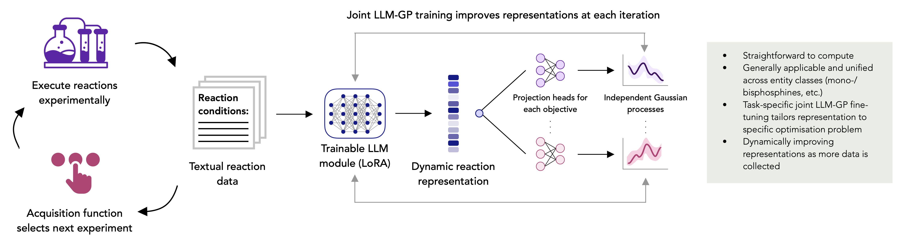

# Dynamic language model representations for multi-objective reaction optimisation

📄 Paper: [](https://arxiv.org/abs/2609.11790)

---



## 🔍 Overview

We present a general framework for multi-objective reaction optimisation that
requires no descriptor computation or feature engineering. Textual descriptions
of reaction conditions — ligands, additives, solvents, catalysts — are encoded
by a fine-tuned language model and passed through objective-specific
projection heads into independent surrogate models, jointly trained end-to-end. The representation
adapts to the reaction system and objectives of the optimisation campaign at hand.

- **Unifying chemically heterogeneous components, out of the box.** A single
  representation can span mono- and bidentate phosphines, chiral Ir and Ru
  catalysts across different metals and coordination geometries, and additives
  from elemental zinc to organic and inorganic bases.
- **Multiple objectives.** Yield, selectivity, diastereomeric ratio, and
  enantiomeric excess can be optimised jointly.
- **Low-data to high-throughput.** Validated from sequential single-experiment
  campaigns to 24/48/96-well plate HTE regimes.
- **Prospective validation.** Two automated HTE campaigns reached
  process-relevant conditions in two rounds (192 reactions, <3% of each design
  space), translating directly to gram scale.

---

## 📦 Installation

Requires Python 3.10+.

```bash
git clone https://github.com/schwallergroup/alice.git
cd alice
```

Three dependency files are provided:

| File | Use |
| --- | --- |
| `environment.yml` | Minimal conda environment — start here |
| `requirements.txt` | The same minimal set-up, for pip |
| `environment.lock.yml` | Transitive freeze of the environment used in this work (linux-64) |

**Quick start (conda):**

```bash
conda env create -f environment.yml
conda activate alice
pip install -e .
```

**Quick start (pip):**

```bash
conda create -n alice python=3.10 -y
conda activate alice
pip install -r requirements.txt
pip install -e .
```

**Exact environment used in this work** (linux-64 only):

```bash
conda env create -f environment.lock.yml
conda activate alice
pip install -e .
```

All experiments in the manuscript were run on NVIDIA A100 GPUs with torch 2.8.0 (CUDA 12.8).

---

## 🧪 Running experiments

### Retrospective benchmarks

The `configs/` directory contains the configuration files used for the
experiments in the manuscript, one per reaction dataset and representation:

```
configs/
├── ni_suzuki/             # Ni-catalysed Suzuki coupling
├── pd_suzuki/             # Pd-catalysed Suzuki coupling
└── pd_sulfonamide/        # Pd-catalysed sulfonamide C–N coupling
```

Each dataset provides three representations:

| Config | Representation |
| --- | --- |
| `<name>_desc.yaml` | Numerical descriptors from descriptor libraries + OHE |
| `<name>_ohe.yaml` | One-hot encoding |
| `<name>_llm.yaml` | Fine-tuned LLM embeddings |

Launch a single run with:

```bash
python train_master.py --config configs/<dataset>/<config>.yaml
```

W&B cloud tracking can be disabled by using (this still writes the local result CSV files and plots):

```bash
WANDB_MODE=disabled python train_master.py --config configs/<dataset>/<config>.yaml
```

The experiments in the manuscript were run as 20-seed W&B sweeps in `configs/`:

```
configs/
├── sweep_ni_suzuki.yaml
├── sweep_pd_sulfonamide.yaml
└── sweep_pd_suzuki.yaml
```

After logging in to W&B, initialize a sweep from the repository root using:

```bash
# to switch between featurisation methods, change parameters.config.value in the sweep file.
wandb sweep configs/<sweep_file>.yaml
# W&B will then print a sweep identifier of the form below which you can use to start the run:
wandb agent <entity>/<project>/<sweep-id>
```

---

## 🔬 Data

The `data/` directory holds the three retrospective benchmark datasets used for evaluation in the manuscript, and the experimental data collected in the two prospective reaction optimisation campaigns.

```
data/
├── benchmark_datasets/
│   ├── ni_suzuki/             # Ni-catalysed Suzuki coupling
│   ├── pd_suzuki/             # Pd-catalysed Suzuki coupling
│   └── pd_sulfonamide/        # Pd-catalysed sulfonamide C–N coupling
└── prospective_campaigns/     # results of the two prospective optimisation campaigns
```

The two datasets `ni_suzuki` and `pd_suzuki` are measured HTE plates
covering a designed subset of their parameter space; `pd_sulfonamide` is a
virtual dataset enumerating the full grid.

### Retrospective benchmarks

Each dataset ships the same reaction data in three representations, so that the
featurizers can be compared on identical data:

| File | Representation |
| --- | --- |
| `<dataset>_desc.csv` | Numerical descriptors from descriptor libraries + OHE |
| `<dataset>_ohe.csv` | One-hot encoding |
| `<dataset>_prompt.csv` | Natural-language reaction prompt, consumed by the LLM featurizers |

### Prospective campaigns

Results of the two prospective optimisation campaigns, in SURF format — one row per reaction,
with CAS numbers and SMILES for every component:

| File | Reaction | Objectives |
| --- | --- | --- |
| `asymmetric_hydrogenation_surf_reaction_data.csv` | Asymmetric hydrogenation | conversion, de (syn), ee (syn) |
| `pd_catalysed_cyanation_surf_reaction_data.csv` | Pd-catalysed cyanation | conversion, selectivity |

Each file contains 192 reactions — two 96-well HTE BO rounds, indexed by the
`BO round` column.

---

## Citation

```bibtex
@misc{sin2026dynamic,
  title         = {Dynamic language model representations for multi-objective reaction optimisation},
  author        = {Sin, Joshua W. and Segura, David Ming and Ranković, Bojana and Chau, Siu Lun and Lutz, Marius D. R. and Anelli, Andrea and Burwood, Ryan P. and Püntener, Kurt and Notheis, Maximilian J. and Bigler, Raphael and Schwaller, Philippe},
  year          = {2026},
  eprint        = {2609.11790},
  archivePrefix = {arXiv},
  primaryClass  = {cs.LG},
  doi           = {10.48550/arXiv.2609.11790},
  url           = {https://arxiv.org/abs/2609.11790}
}
```

---

## License

This project is licensed under the **Apache 2.0 License**. See the `LICENSE` file for details.

---

## Acknowledgements

This work was supported by NCCR Catalysis (grant no. 225147), a National Centre
of Competence in Research funded by the Swiss National Science Foundation, and
by the Swiss National Science Foundation (SNSF) [226509].