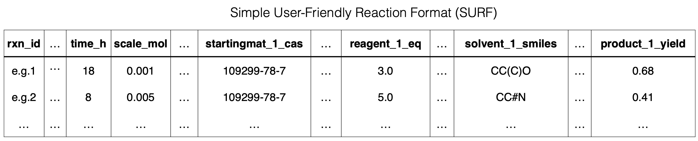

# HTE experimental data

Experimental reaction data collected for the Palladium-catalysed cyanation case study and the Asymmetric hydrogenation case study detailed in the manuscript accompanying this repository. All collected experimental data are available in the Simple User-Friendly Reaction Format ([SURF](https://doi.org/10.1002/minf.202400361)).

